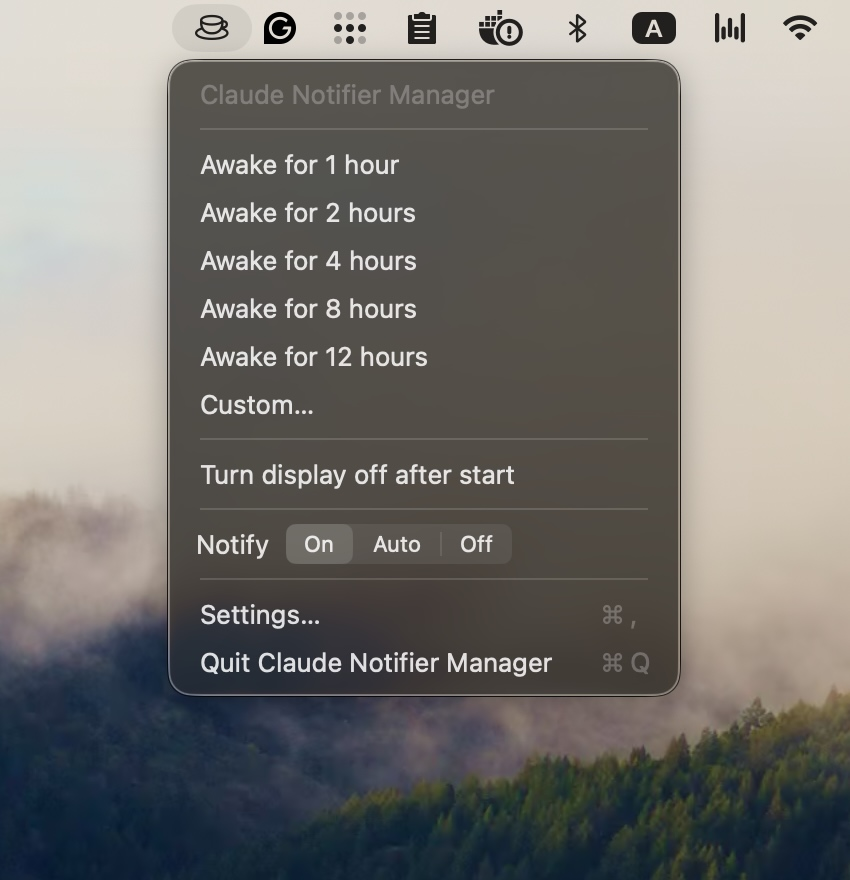
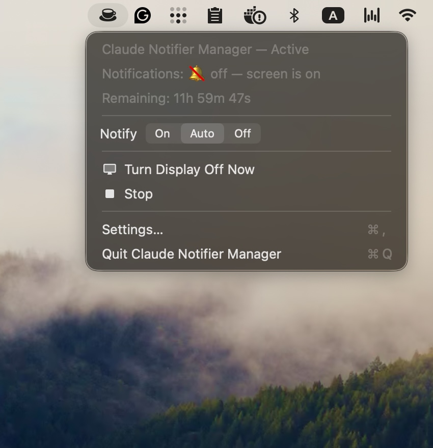
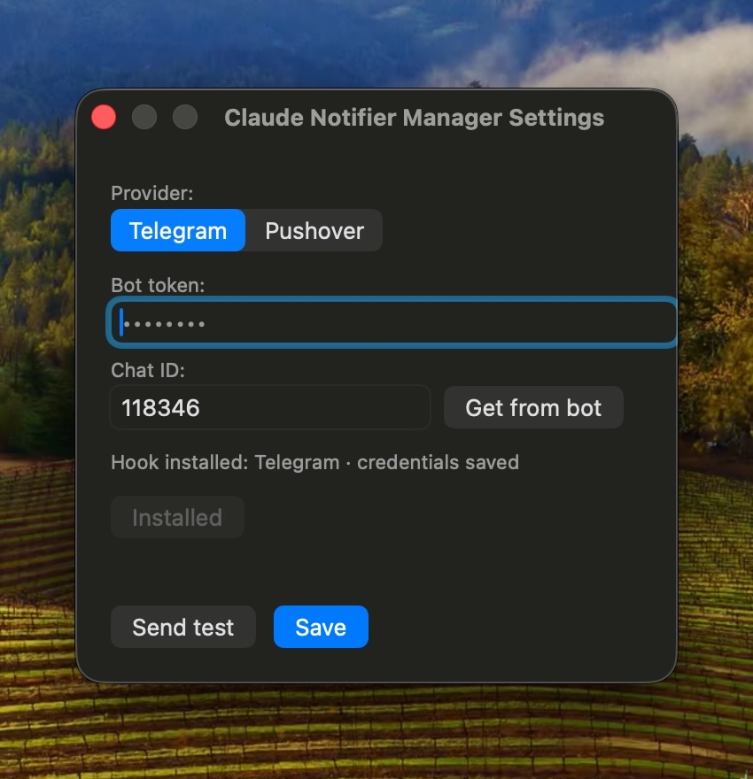

# 🔔 Claude Code Phone Notifications

Send a phone notification when Claude Code needs your attention.

Sub-agent events are ignored.

<p align="left">
  
  
  
</p>

## 📁 Files

- `notify-pushover.sh` — Pushover notifier
- `notify-telegram.sh` — Telegram notifier
- `claude-settings-file-part.json` — Claude Code hooks
- `Makefile` — build, install, and run shortcuts for the app
- `app/` — Claude Notifier Manager menu bar app (credentials live in its Settings)

Claude Code always calls:

```text
~/.claude/hooks/notifier.sh
```

Choose a notifier and copy it with this name.

## 📲 Notifications

You get a notification when the main Claude agent:

- ❓ asks a question
- 🔐 needs permission
- 🧩 waits for MCP input
- ⏸️ needs input from a background session
- ⚠️ stops because of an API error
- ✅ finishes and waits for you

Every notification uses the same shape — a bold headline naming the project,
then the detail:

```text
✅ claude-notifier: Claude finished
Claude has finished and is waiting for you.
```

Telegram gets it as one HTML message; Pushover puts the headline in the title
field, which its clients already render bold.

## 🛠️ Setup

### 1. Install dependency

```bash
brew install jq
```

### 2. Install the app

From the repo root:

```bash
make install
make run
```

### 3. Add your credentials and install the notifier

Click the cup in the menu bar, then **Settings…**

#### Pushover

Create an application at https://pushover.net/, then paste:

- User Key
- Application API Token

Press **Save**.

#### Telegram

Create a bot with `@BotFather`, then paste the bot token.

Send `/start` to your bot and press **Get from bot**. The chat ID is fetched for
you. Press **Save**.

Both are stored in the macOS Keychain, in the same items the notifier scripts
read.

Then press **Install** to copy that provider's script to
`~/.claude/hooks/notifier.sh`. Both scripts ship inside the app bundle, so this
needs nothing from the repo.

Finally press **Send test**. It runs your real `~/.claude/hooks/notifier.sh`, so
if your phone buzzes, the whole chain works.

> 📝 Prefer to do it by hand, or not using the app?
>
> ```bash
> mkdir -p ~/.claude/hooks
> cp notify-telegram.sh ~/.claude/hooks/notifier.sh   # or notify-pushover.sh
> chmod 700 ~/.claude/hooks/notifier.sh
> ```

### 4. Configure Claude Code

Merge the `hooks` from:

```text
claude-settings-file-part.json
```

into:

```text
~/.claude/settings.json
```

> 📝 Keep notifier hooks as separate entries from existing hooks.
>
> If an event already exists, keep it and add the notifier entry next to it.

### 5. Verify

Start Claude Code and run:

```text
/hooks
```

Check that the hooks are registered.

## 🚦 The `enabled` flag

Every notifier starts with the same gate:

```bash
ENABLED="$(defaults read com.ashatrov.claude-notifier enabled 2>/dev/null || echo 0)"

[[ "$ENABLED" == "1" ]] || exit 0
```

Nothing is sent until that flag is `1`. A fresh install is silent by design — you
only want your phone buzzing when you are away from the Mac.

Set it by hand with:

```bash
defaults write com.ashatrov.claude-notifier enabled -bool true
defaults write com.ashatrov.claude-notifier enabled -bool false
```

There is one other way past the gate: `CLAUDE_NOTIFIER_TEST=1` in the
environment makes the script send whatever the flag says. That is how the app's
**Send test** button works — a test has to send even while muted, and the app
must not borrow a flag that a running session owns.

```bash
echo '{"cwd":"'"$PWD"'"}' | CLAUDE_NOTIFIER_TEST=1 ~/.claude/hooks/notifier.sh done
```

Or let the menu bar app manage it for you.

## ☕ Menu bar app

`app/` holds **Claude Notifier Manager**, a small macOS menu bar app for leaving Claude
Code running unattended. While a session is active it:

- runs `caffeinate -i`, so the Mac will not idle-sleep;
- lets the display sleep normally;
- sets `enabled` to `1` **only while every display is asleep**;
- sets it back to `0` the moment any display wakes;
- stops on its own after the duration you picked.

The point of the display rule: notifications reach your phone while you are away,
and go quiet the second you sit back down. Waking the screen never stops
`caffeinate` — the session keeps running until it times out or you stop it.

That display rule is the `Auto` mode of the menu's `Notify [ On | Auto | Off ]`
switch, and it is the default. `On` holds `enabled` at `1` for the whole session
whatever the display is doing; `Off` holds it at `0` and keeps the phone quiet
while the Mac stays awake. No mode notifies without a session.

The app never talks to Telegram or Pushover. It only owns the `enabled` flag,
which is what keeps the providers interchangeable.

### Install

The built bundle is committed, so no toolchain is required. From the repo root:

```bash
make install   # copies it to ~/Applications
make run       # opens ~/Applications/"Claude Notifier Manager.app"
```

To rebuild after changing the Swift source (needs the Swift toolchain from
Xcode Command Line Tools):

```bash
make build             # arm64
make build-universal   # universal, also runs on Intel Macs
```

`make install` never builds — it ships the bundle that is checked out. Run
`make build` first if you changed the source.

### Use

Click the cup in the menu bar and pick a duration — 1, 2, 4, 8, 12 hours, or
`Custom…` for anything else, decimals included. The icon fills in while a
session is active, and the menu shows the time remaining.

`Turn display off after start` (on by default) runs `pmset displaysleepnow`
right after starting, so you can walk away immediately. `Notify [ On | Auto |
Off ]` chooses when the phone rings, defaults to `Auto`, is remembered between
launches, and applies immediately even mid-session. While active, the menu
offers `Turn Display Off Now` — which does not change the timeout — and `Stop`.

Stopping, timing out, and quitting all clear `enabled`. The app will not leave
it set.

> 📝 While the app is running it owns the flag. A manual `defaults write` will
> be overwritten at the next display transition.

## 🔄 Switch provider

Open **Settings…**, pick the other provider, press **Switch to …**. That is the
whole thing — `~/.claude/settings.json` never changes.

Both providers' credentials can live in the Keychain at once. Only the installed
`notifier.sh` decides which is used, and Settings shows which one that is.

## 🩺 How the app knows what is installed

Each script carries a marker on its second line:

```zsh
# claude-notifier: telegram
```

That says which provider it is. To tell a current copy from a stale one the app
compares the installed file against the one in its bundle, byte for byte — so
fixing a script and rebuilding is enough to mark every installed copy stale.
There is no version number to bump.

What Settings shows, and what the button then offers:

| On disk | Button |
| --- | --- |
| nothing | **Install** |
| same provider, same bytes | **Installed**, disabled |
| same provider, older copy | **Update** |
| the other provider | **Switch to …** |
| no marker, not ours | **Replace…**, after confirming |

The menu bar stays quiet unless something needs attention, in which case it
grows one `⚠︎` row that opens Settings.

A script edited by hand still counts as "ours" if the marker survives, so the
app will offer to overwrite your edits. Rename the marker to keep them.
